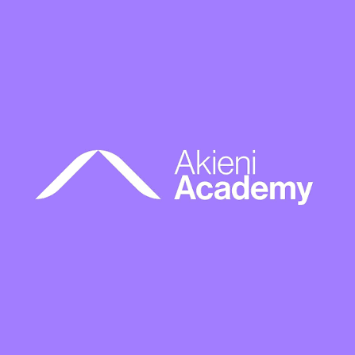

<div align="center">

[](https://github.com/dravelimbolo/strategie-communication-frontend-backend)

**`Cours · Collaboration · Contrat d'API · Git Flow · Code review · Agile`**

_Faire travailler une équipe Frontend React et une équipe Backend Express ensemble, sans conflit._

<br/>

[](https://dravelimbolo.com)
[](https://linkedin.com/in/dravel-imbolo)
[](https://github.com/dravelimbolo)
[](mailto:contact@dravelimbolo.com)

<br/>

[](#mentorat)
[](LICENSE)
[](CONTRIBUTING.md)

</div>

---

<div align="center">

```
Problèmes   ·   Conventions   ·   Rôles   ·   Règles   ·   Rituels   ·   Contrat   ·   OpenAPI
```

_Le lien entre le Frontend et le Backend n'est pas seulement GitHub : c'est d'abord un contrat d'équipe, puis un contrat d'API._

</div>

---

## Stack technique

<table align="center">
<tr>
  <td align="center">
    <strong>Frontend</strong><br/>
    
  </td>
  <td align="center">
    <strong>Backend</strong><br/>
    
  </td>
  <td align="center">
    <strong>Collaboration & Outils</strong><br/>
    
  </td>
</tr>
</table>

---

## Le modèle de collaboration

```
Problèmes récurrents  ──>  Conventions · Rôles · Règles · Rituels  ──>  Contrat d'équipe
                      ──>  Contrat d'API (OpenAPI + Swagger)  ──>  Mocks · Git · Tickets
```

```
strategie-communication-frontend-backend/
├── 01_introduction_et_definitions.md          # Définitions, démarche, objectifs
├── 02_problemes_recurrents.md                 # Les conflits classiques et leurs causes
├── 03_conventions_communes.md                 # Code · API (nommage, erreurs, pagination) · Git · env
├── 04_roles_et_responsabilites.md             # Qui fait quoi · référents · validation des deux côtés
├── 05_regles_d_equipe.md                      # 5 règles fondamentales · Definition of Done
├── 06_rituels_et_communication.md             # Daily · canaux · relecture bienveillante · désaccords
├── 07_contrat_d_equipe.md                     # Modèle de contrat · atelier de lancement
├── 08_contrat_api_openapi.md                  # OpenAPI · design-first · lire un contrat
├── 09_travailler_en_parallele.md              # Mocks avec Prism, MSW, json-server
├── 10_git_et_branches.md                      # Git Flow · CODEOWNERS · modèle de PR · commits
├── 11_tickets_et_suivi.md                     # Bon ticket · labels · tableau Kanban
├── 12_gerer_les_changements_api.md            # Changements cassants · transition · versionnement
├── 13_modele_recommande.md                    # Modèle complet · checklist de démarrage
├── 14_bonus_installer_openapi_swagger.md      # Installation et configuration pas à pas
├── 15_glossaire.md                            # Termes expliqués simplement
├── 16_travaux_pratiques.md                    # 10 TP en binôme Frontend + Backend
├── assets/                                    # Logo Akieni Academy
├── CONTRIBUTING.md                            # Guide de contribution
├── LICENSE                                    # Licence CC BY 4.0
└── README.md
```

### Ce que tu vas apprendre

| Notion | Mise en oeuvre dans le cours |
|---|---|
| **Problèmes récurrents** | Reconnaître les conflits classiques et leur cause commune : l'absence d'accord écrit |
| **Conventions** | Nommage, format d'erreur, pagination, outils de qualité, environnements partagés |
| **Responsabilités** | Tableau « qui fait quoi », référents, validation côté Frontend et côté Backend |
| **Règles et rituels** | 5 règles fondamentales, Definition of Done, daily, relecture de code bienveillante |
| **Contrat d'équipe** | Tous les accords rassemblés dans un document validé lors d'un atelier de lancement |
| **Contrat d'API** | Fichier OpenAPI écrit avant le code et relu par les deux équipes |
| **Swagger en pratique** | Swagger UI, validation automatique des requêtes, lint Redocly, mock Prism, CI |
| **Outillage** | Mocks, Git Flow, `CODEOWNERS`, tickets, gestion des changements d'API |

---

## Par où commencer

> **Prérequis :** bases de JavaScript, React et Express · notions de HTTP et JSON · Git et GitHub

| Étape | Chapitres | Objectif |
|---|---|---|
| **1** | [01](01_introduction_et_definitions.md) et [02](02_problemes_recurrents.md) | Définir les notions et comprendre les problèmes récurrents |
| **2** | [03](03_conventions_communes.md) à [06](06_rituels_et_communication.md) | Se mettre d'accord : conventions, responsabilités, règles, rituels |
| **3** | [07](07_contrat_d_equipe.md) | Rassembler ces accords dans le contrat d'équipe |
| **4** | [08](08_contrat_api_openapi.md) puis [14](14_bonus_installer_openapi_swagger.md) | Écrire le contrat d'API, installer et configurer OpenAPI et Swagger |
| **5** | [09](09_travailler_en_parallele.md) à [13](13_modele_recommande.md) | Outiller la collaboration : mocks, Git, tickets, changements d'API |
| **6** | [16](16_travaux_pratiques.md) | Appliquer tout le modèle en binôme |

> Le [glossaire](15_glossaire.md) explique simplement chaque terme technique.

### Cours associé

Ce cours complète **[Stratégies de déploiement d'une application React + Express](https://github.com/dravelimbolo/strategies-deploiement-react-express)** : le premier explique comment livrer l'application, celui-ci comment la construire ensemble.

---

## Mentorat

<table align="center">
<tr>
  <td align="center">
    
  </td>
  <td>
    <strong>Suivi Individuel Mentorat · Akieni Academy</strong><br/><br/>
    Mentor référent : <strong>Dravel-Ameguste IMBOLO</strong><br/>
    Contact : <a href="mailto:contact@dravelimbolo.com">contact@dravelimbolo.com</a>
  </td>
</tr>
</table>

---

## Contributions

<table style="border-spacing:0; font-size:13px; width:100%;">
<tr>
  <th style="padding:8px 12px;">Rôle</th>
  <th style="padding:8px 12px;">Personne</th>
  <th style="padding:8px 12px;">Contribution</th>
</tr>
<tr>
  <td style="padding:8px 12px;"><strong>Auteur & mainteneur</strong></td>
  <td style="padding:8px 12px;"><a href="https://github.com/dravelimbolo">Dravel IMBOLO</a></td>
  <td style="padding:8px 12px;">Conception du cours · rédaction · travaux pratiques · mentorat</td>
</tr>
</table>

Les contributions sont les bienvenues. Avant d'ouvrir une pull request, lis le **[guide de contribution](CONTRIBUTING.md)** : branches Git Flow, commits conventionnels et pull requests vers `develop`.

---

## Licence

Distribué sous licence **Creative Commons Attribution 4.0 International (CC BY 4.0)**. Voir le fichier [LICENSE](LICENSE).

Tu peux partager et adapter ce cours, à condition de citer l'auteur et de fournir un lien vers la licence.

Copyright (c) 2026 **Dravel IMBOLO**.

---

<div align="center">

<br/>

_"Transformons des idées en applications fonctionnelles, robustes et scalables."_

<br/>

</div>
